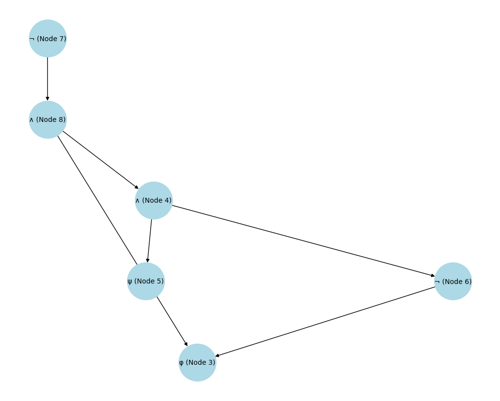

# Linear SAT Solver

This project is an implementation of a linear SAT solver based on the book "Logic in Computer Science: Modelling and Reasoning about Systems" by Michael Huth and Mark Ryan.

## Table of Contents
- [Introduction](#introduction)
- [Methodology](#methodology)
  - [Translation](#translation)
  - [Parse Tree](#parse-tree)
  - [Directed Acyclic Graph (DAG)](#directed-acyclic-graph-dag)
  - [SAT Problem](#sat-problem)
  - [Tautology Check](#tautology-check)
- [Results](#results)
- [References](#references)

## Introduction

This project implements a SAT solver that translates logical formulas into a form suitable for analysis using a Directed Acyclic Graph (DAG). The solver is designed to be linear in complexity, providing efficient solutions for satisfiability problems.

## Methodology

### Translation

The solver translates logical formulas into a standardized format using the rules provided in the book. This transformation is essential for converting formulas into a form that can be easily parsed and processed by the solver. The translation process uses the inductively defined transformation rules from the book:

####
$$
\begin{aligned}
T(p) &= p \\
T(\neg \phi) &= \neg T(\phi) \\
T(\phi_1 \land \phi_2) &= T(\phi_1) \land T(\phi_2) \\
T(\phi_1 \lor \phi_2) &= \neg (\neg T(\phi_1) \land \neg T(\phi_2)) \\
T(\phi_1 \rightarrow \phi_2) &= \neg (T(\phi_1) \land \neg T(\phi_2))
\end{aligned}
$$


These rules ensure that the transformed formula $T(\phi)$ is semantically equivalent to the original formula $\phi$, and thus $\phi$ is satisfiable if and only if $T(\phi)$ is satisfiable.

**Code:**
```python
def translate(expr):
    # Helper function to handle negation and implication
    def replace_implication(match):
        left = match.group(1)
        right = match.group(2)
        # Recursive translation of each side of the implication
        left_translated = translate(left.strip())
        right_translated = translate(right.strip())
        return f'(¬{left_translated} ∨ {right_translated})'

    # Remove all spaces to simplify parsing
    expr = re.sub(r'\s+', '', expr)

    # Handle nested expressions first by recursively translating innermost parentheses
    while '(' in expr:
        expr = re.sub(r'\(([^()]+)\)', lambda m: translate(m.group(1)), expr)

    # Translate implications, handling right to left to manage nested implications
    while '→' in expr:
        expr = re.sub(r'([^()→]+)→([^()→]+)', replace_implication, expr)

    # Apply De Morgan's laws to disjunctions after handling implications
    expr = re.sub(r'([^()∨]+)∨([^()∨]+)', lambda m: f'¬(¬{translate(m.group(1))} ∧ ¬{translate(m.group(2))})', expr)

    # Remove double negations as the last step after all other transformations
    while '¬¬' in expr:
        expr = re.sub(r'¬¬', '', expr)

    return expr
```

### Parse Tree

The solver constructs a parse tree from the translated formula. This tree represents the hierarchical structure of the logical expression, making it easier to apply logical operations and transformations. The parse tree is constructed by identifying the top-level operator in the formula and recursively parsing its sub-expressions.

**Code:**
```python
def parse_formula(expr):
    def parse(expr):
        expr = expr.strip()
        if expr.startswith('(') and expr.endswith(')'):
            expr = expr[1:-1].strip()
        operator_pos = find_top_level_operator(expr)
        if operator_pos is not None:
            operator = expr[operator_pos]
            left = expr[:operator_pos]
            right = expr[operator_pos + 1:]
            return Node(operator, [parse(left), parse(right)])
        elif expr.startswith('¬'):
            return Node('¬', [parse(expr[1:].strip())])
        else:
            return Node(expr)

    def find_top_level_operator(expr):
        depth = 0
        for i, char in enumerate(expr):
            if char == '(':
                depth += 1
            elif char == ')':
                depth -= 1
            elif (char == '∧' or char == '∨') and depth == 0:
                return i
        return None

    expr = re.sub(r'\s+', '', expr)
    return parse(expr)
```

### Directed Acyclic Graph (DAG)

The parse tree is then converted into a DAG, where common subformulas are shared to reduce redundancy. This representation is crucial for the linear time complexity of the solver. The DAG ensures that each unique subformula is represented only once, allowing efficient marking and evaluation.

**Code:**
```python
class Node:
    def __init__(self, value, children=None):
        self.value = value
        self.children = children if children else []
        self.id = None  # Unique identifier for each node
        self.isShared = False

    def set_id(self, node_id):
        if self.id is None:
            self.id = node_id

    def DAG(self, level=0, prefix=""):
        # Include the node ID in the output
        ret = "\t" * level + prefix + f"Node {self.id}: {self.value}"
        if(self.isShared == True):
          ret += " (shared)\n"
        else:
          ret += "\n"
        for i, child in enumerate(self.children):
            ret += child.DAG(level + 1, "├── " if i < len(self.children) - 1 else "└── ")
        return ret
    def tree(self, level=0, prefix=""):
        ret = "\t" * level + prefix + str(self.value) + "\n"
        for i, child in enumerate(self.children):
            ret += child.tree(level + 1, "├── " if i < len(self.children) - 1 else "└── ")
        return ret

# Example usage
expr = "p ∧ ¬(q ∨ ¬p)"
translated_expr = translate(expr)
root = parse_formula(translated_expr)
print(root.tree())
draw_tree(root)
```

### SAT Problem

The core of the solver checks the satisfiability of the formula. It evaluates all possible valuations of variables to determine if there is any assignment that makes the formula true. The evaluation process uses the rules for propagating truth and falsehood constraints through the DAG, ensuring that all constraints are consistently applied.

**Code:**
```python
def check_satisfiability(root):
    variables = list(find_variables(root))
    all_valuations = list(product([True, False], repeat=len(variables)))
    satisfying_valuations = []
    for valuation in all_valuations:
        val_dict = dict(zip(variables, valuation))
        if evaluate_formula(root, val_dict):
            satisfying_valuations.append(val_dict)
    return satisfying_valuations
```

### Tautology Check

The solver can also check if a formula is a tautology, meaning it is true for all possible valuations of its variables. This is done by evaluating the formula under all possible assignments and verifying that it holds true in every case.

**Code:**
```python
def check_tautology(root):
    variables = list(find_variables(root))
    all_valuations = list(product([True, False], repeat=len(variables)))
    for valuation in all_valuations:
        val_dict = dict(zip(variables, valuation))
        if not evaluate_formula(root, val_dict):
            return False
    return True
```

## Results

The solver was tested on seven axiom logics and various random formulas. The results are as follows:

- **Axiom Logics:**
  - For each axiom logic, the solver provided the correct satisfiability and tautology status.

- **Random Formulas:**
  - The solver efficiently determined the satisfiability and tautology status for multiple random formulas.

### Example Results

Here you can see the results of the SAT solver on different formulas. The charts below represent the outcomes of the solver.




**Example Code Execution:**
```python
expr = "p ∧ ¬(q ∨ ¬p)"
translated_expr = translate(expr)
root = parse_formula(translated_expr)
print("Tree Representation:")
print(root.tree())
draw_tree(root)

# Checking satisfiability and tautology
satisfying_valuations = check_satisfiability(root)
is_tautology = check_tautology(root)

print("Satisfying Valuations:", satisfying_valuations)
print("Is the formula a tautology?", is_tautology)
```

## References

- [Logic in Computer Science: Modelling and Reasoning about Systems](http://staff.ustc.edu.cn/~huangwc/book/LogicInCS.pdf) by Michael Huth and Mark Ryan.
